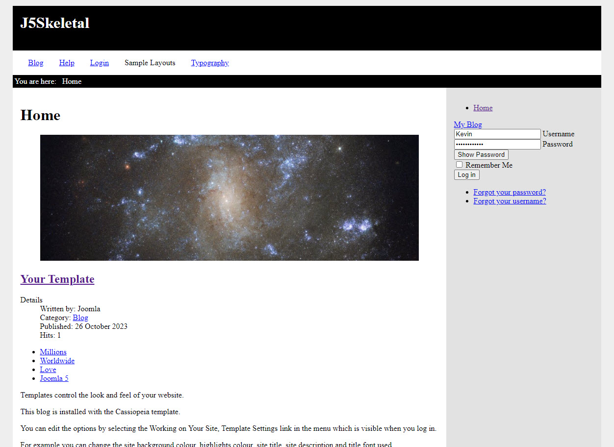

# Skeletal Template
Basically the simplest template you could start with for Joomla 5.

I've had several requests for an even simpler template than j4/joomstarter.
So if you're looking for the absolute, bare minimum template, this is it.
It contains a basic layout, a CSS file, and a JavaScript file.
It doesn't load Bootstrap, FontAwesome, or anything else.
It is entirely contained to one folder. No need to look for files spread out across several directories.
I skipped using language files entirely.

This is not the "proper" way to make a template. But if you're just doing this for yourself, it may be a nice
starting point.

